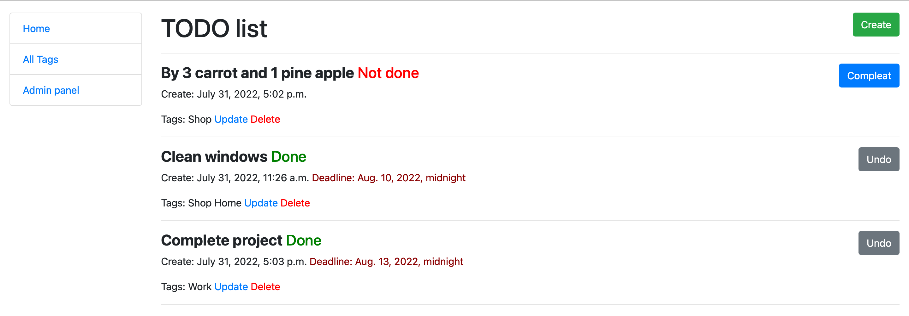
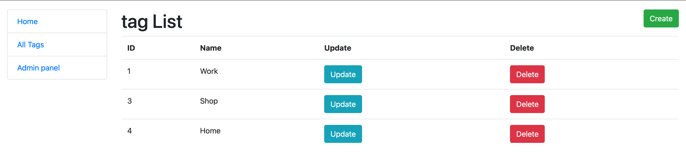
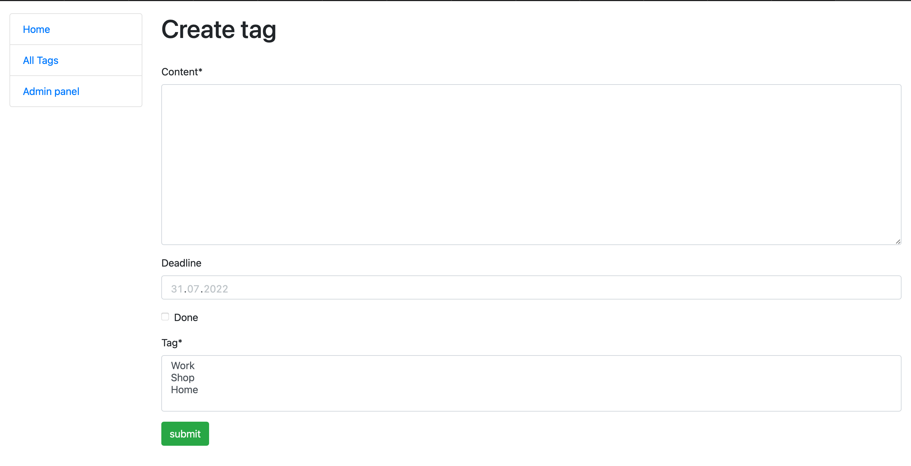
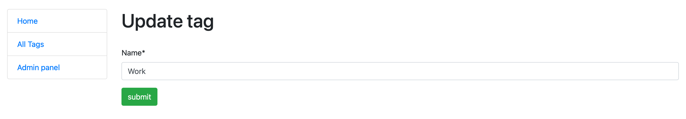

# Todo-list

service for maintaining to-do lists, create in Django


## Installation

Python3 must be already installed

```shell
git clone https://github.com/Vasyl-Smutok/django-Todo-list.git
cd taxi_service
python3 -m vemv vemv
source vemv/bin/activate  #on macOS
venv\Scripts\activate  #on Windows 
pip install -r requirements.txt  
python manage.py migrate 
python manage.py createsuperuser #create your super user
python manage.py runserver # start Django Server
```

### Interface images:


#### home page


#### Tags list


#### Create task


#### Delete task


#### Update tag
